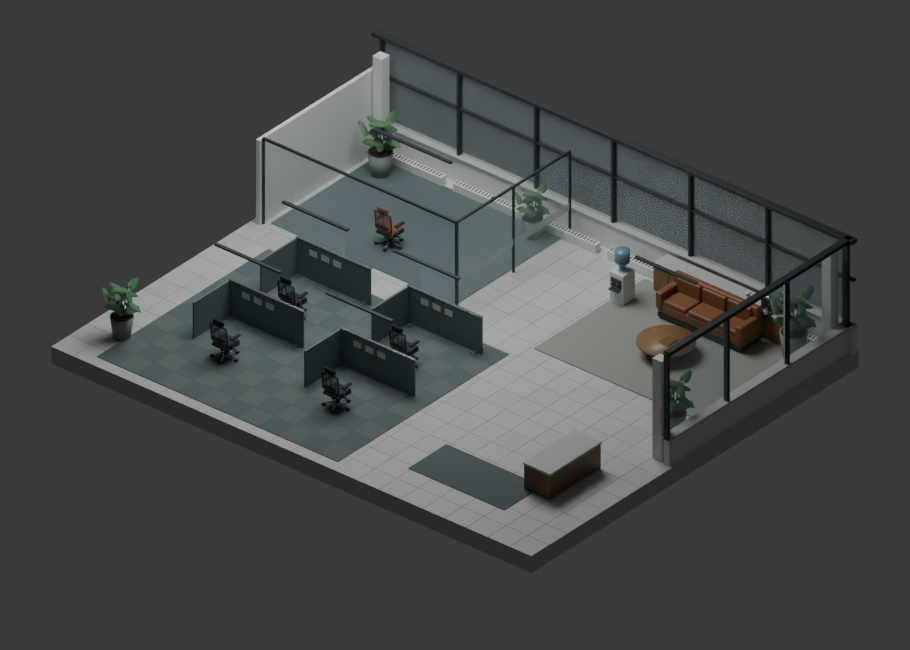

# Fourteenth Floor

A spatial workspace for AI-assisted software development. Project folders become offices, agents occupy desks, and tickets connect their assignments, handoffs, code changes, and checks.



## Run locally

Requires Node.js 20.19+ and npm. Live agent work also requires the Codex CLI and a supported signed-in account.

```sh
npm ci
npm run dev
```

Open **http://127.0.0.1:4314**. For a production build, run `npm run build`, then `npm start`.

The sample office works without signing in and is explicitly simulated. For live work, connect Codex through the app and choose an existing local project folder. Fourteenth uses its own sign-in profile in `~/.fourteenth/codex`; it does not switch the Codex desktop app's account. Account model availability and usage limits apply.

On Windows, `npm run runtime:install` installs the pinned project-local Codex runtime. Restart Fourteenth after installation. Complete Windows sandbox setup from the connection panel before starting work if requested.

## Use it

1. **Open a project.** Create an office for a local checkout.
2. **Describe the work.** Start work applies a reusable workflow. The manager delegates bounded research and review for substantial tasks and remains the implementation owner. A new ticket can also stay in the backlog without running a model.
3. **Follow the office.** Desks show published progress, commands, changes, and task state. Tickets, the compact map, and Inbox provide direct access without moving the camera. Private reasoning is not displayed.
4. **Coordinate.** Handoffs connect findings to assignments. Declared file scopes and dependencies help sequence work. Pair a teammate's office to exchange status and context across separate checkouts.
5. **Inspect the result.** Open the diff, recorded checks, and feature URL. Verification requires acceptance checks and evidence; an agent's completion message alone is insufficient. The feature's development server must remain running.

Replacing an agent preserves its task and handoff. Development modes adjust the next turn's model policy, reasoning, concurrency, and time budget. Checkpoints support inspection and branching; they are not a substitute for Git review.

## Team offices

Each participant runs Fourteenth with their own checkout and account. **Team** creates or accepts a short-lived invitation. Pairing shares assignments and explicit handoffs; it does not synchronize files or merge branches.

The current transport supports **one real paired teammate per project**. The visual district supports nine offices with selective interior detail; the **+** control adds local visual previews, not authenticated teammates. [Connection guide and limitations](docs/team-offices.md).

To rehearse two connected offices without model calls:

```sh
npm run build
npm run demo:team
```

Open **http://127.0.0.1:4351** and **http://127.0.0.1:4352**. Pair Alex and Blair through Team using the loopback address. These offices use test agents and real HTTP transport, clearly labeled in the UI.

## Controls

| Control | Action |
| --- | --- |
| Drag / wheel | Orbit and zoom |
| Overview / Map / Walk | Change the project view |
| WASD / arrows | Move in walk mode |
| E | Inspect the focused desk |
| Esc | Close an inspector or return to overview |
| Sidebar | Tickets, agents, handoffs, team, Inbox, history, tools, settings |

Tools includes workflows, skills, Cursor setup, development modes, and presentation controls. The recording studio selects camera stops and a clean view; it does not record video.

## Cursor and skills

The `.cursor/mcp.json` configuration and `/office` command connect an existing Cursor session to Fourteenth. Cursor controls its own execution and permissions. Reports are marked as reported evidence and cannot automatically verify a task. No separate provider API key is needed by this integration.

Reusable manager, handoff, and review skills live in `skills/`. The app can install them into a project's `.agents/skills` without overwriting differing instructions.

## Validation

```sh
npm test
```

The test command builds the production assets first because the API tests exercise the production server.

Tests cover lifecycle, delegation, dependencies, evidence, permissions, model replacement, checkpointing, and paired-office transport using isolated deterministic test adapters. They do not establish live model quality or headset performance.

`examples/project-starter` is a small React starting point. `examples/project-result` preserves a completed agent-built feature, with its own tests and setup. [Architecture and execution boundaries](docs/architecture.md).

## Local data

State, checkpoints, and pairing credentials remain in ignored `.office/` storage. The app listens on loopback and validates requests. The separate team listener exposes only pairing/status/handoff operations on a trusted network; see the team guide before connecting. Do not expose the execution API publicly.

Optional configuration: `PORT`, `OFFICE_DATA_DIR`, `OFFICE_CODEX_HOME`, `OFFICE_CODEX_BIN`, `OFFICE_CODEX_ARGS`, and `OFFICE_TEAM_PORT`. Credentials are never part of this repository.

## Assets and VR

The office geometry and procedural city were created for this project. The runtime model is included at `public/models/office-shell.glb`; asset provenance is in `assets/`. Blender is optional for authoring and is not started by the app. From the repository root, an explicitly launched Blender session can run `scripts/build_office_assets.py`; `FOURTEENTH_ROOT` overrides its output root. That script replaces the active scene, so use a fresh Blender file.

Three.js WebXR provides an initial headset path. Headset comfort, controller behavior, and production VR performance are unverified; the supported demonstration is the desktop walkthrough.
